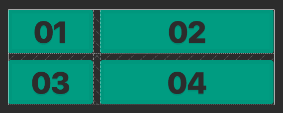
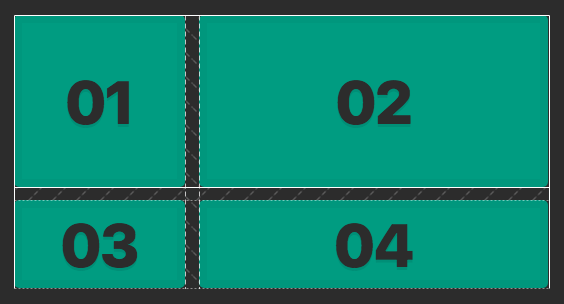
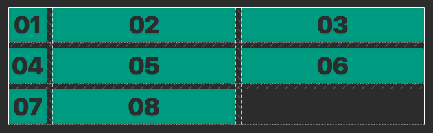
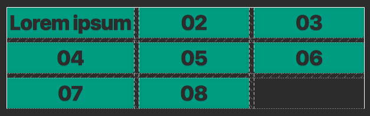
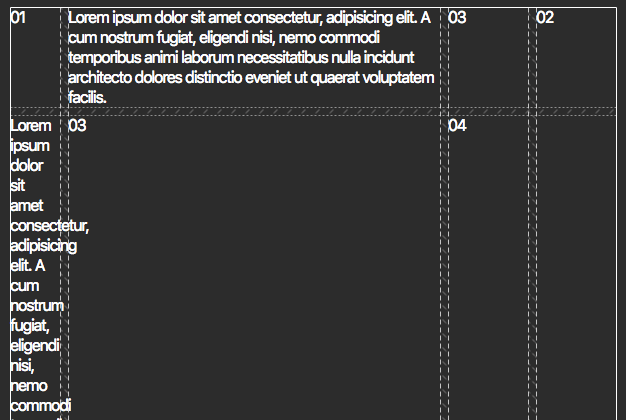
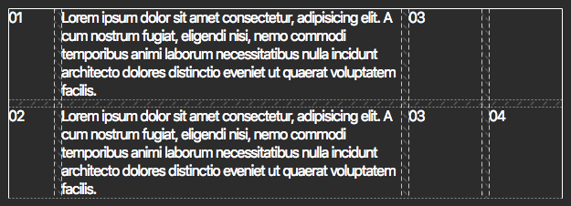

## Wesbos's [CSS Grids](https://developer.mozilla.org/en-US/docs/Web/CSS/grid) Course Takeaways

### 03 : CSS Grid Fundamentals

Creating a grid container

`display: grid`

```scss
.container {
  display: grid;
}
```

[grid-template-columns](https://developer.mozilla.org/en-US/docs/Web/CSS/grid-template-columns)

Setting number of columns in grid. Accepts `rems/ems`, `px`, `'auto'` and `fr` ([fractional unit](#fractional-unit))

```scss
.container {
  display: grid;
  grid-template-columns: 100px 100px 100px; // grid has 3 columns of 100px
}
```

[grid-template-rows](https://developer.mozilla.org/en-US/docs/Web/CSS/grid-template-rows)

Setting height of grid items. Accepts `rems/ems`, `px` and `fr` ([fractional unit](#fractional-unit)).

```scss
.container {
  display: grid;
  grid-template-columns: 100px auto;
  grid-template-rows: 100px 100px; // first two rows explicitly has height of 100px
}
```

Creating a gap between items

[grid-gap](https://developer.mozilla.org/en-US/docs/Web/CSS/gap)

```scss
.container {
  display: grid;
  grid-template-columns: 100px 100px 100px; // or grid-template-rows
  grid-gap: 8px;
}
```

### 04 : CSS Grid Dev Tools

Line Meanings in Firefox Dev Tools


### 05 : CSS Grid Implicit vs Explicit Tracks

Considering we have 4 items in our grid as such:

```html
<div class="container">
  <div class="item">01</div>
  <div class="item">02</div>
  <div class="item">03</div>
  <div class="item">04</div>
</div>
```

and grid styling as such:

```scss
.container {
  display: grid;
  grid-gap: 8px;
  grid-template-columns: 100px auto;
}
```

which gives us this:



Looking closer, you can see a solid line on the top, left and right side of our grid. These are our boundary lines of our grid. Now if you take a look in between the grid items vertically, you will notice these dashed lines. These are our explicit tracks, because we have explicitly define them in our css. As for the horizontal dotted lines, these are our implicit tracks. These are tracks decided by the browser should there not be an explicit property set. In this case, it is our `grid-template-rows` property. So when the browser is told to split the grid into columns of 100px and auto, it explicitly makes the grid into a column of two. But with 4 items, the browser will implicitly split the items in the grid to two rows thus making them and implicit track.

To depict this, try adding `grid-template-rows: 100px` to your `.container` style as such:

```scss
.container {
  display: grid;
  grid-gap: 8px;
  grid-template-columns: 100px auto;
  grid-template-rows: 100px;
}
```

Here we only explicitly define the first row to be 100px and this is what the browser comes up with.



Now we can see the firsts row being an explicit track whereas the second row isn't.

[grid-auto-rows](https://developer.mozilla.org/en-US/docs/Web/CSS/grid-auto-rows)

Defines the width/height of grid item depending on the value set in [grid-auto-flow](#grid-auto-flow)

```scss
.container {
  display: grid;
  grid-gap: 8px;
  grid-template-columns: 100px 100px;
  grid-template-rows: 50px 50px;
  grid-auto-rows: 100px; // Defines all implicit rows to have height of 100px
}
```

### <a name="grid-auto-flow"></a> 06 : CSS grid-auto-flow explained

[grid-auto-flow](https://developer.mozilla.org/en-US/docs/Web/CSS/grid-auto-flow)

Controls how implicit items are flowed into the grid. Accepts `'row'`, `'column'`, `'row dense'` and `'column dense'`.

In the previous module, `grid-auto-rows: 100px` defines all implicit items to have height of 100px. This is because by default, `grid-auto-flow` is set to `row`. In the case where we want to set our grid to grow horizontally, we can utilize `grid-auto-flow: column` with `grid-auto-columns` to define our grid. Here's an example:

```scss
.container {
  display: grid;
  grid-gap: 8px;
  grid-template-columns: 100px 100px;
  grid-auto-flow: column;
  grid-auto-columns: 50px;
}
```

So in short, `grid-auto-flow: row` goes with `grid-auto-rows: [value]` and `grid-auto-flow: column` goes with `grid-auto-columns: [value]` when dealing with implicit items in our grid.

> Additional: `grid-auto-flow` has a dense modifier that forces the grid to fill up empty spaces. More [here](#grid-auto-flow-dense)

## 07 : Sizing tracks in CSS Grid

**<a name="fractional-unit"></a> Fractional Unit**

Note: `fr` does not accept decimal values as it will simply assume it as `1fr`

Apart from explicitly giving columns and rows a fixed amount of pixel, fraction unit allows us to create column and rows that are relative to the container size. Here are some examples.

Let's say we want to split our grid into 4 columns that are equal in width, we'll utilize `fr` like this.

```scss
.container {
  display: grid;
  grid-gap: 8px;
  grid-template-columns: 1fr 1fr 1fr 1fr;
}
```

and if we wanted a grid that looks like a shopping card where our 2nd column is bigger than the rest, we'll utilize `fr` like this.

```scss
.container {
  display: grid;
  grid-gap: 8px;
  grid-template-columns: 1fr 5fr 1fr 1fr;
}
```

As mentioned, `fr` also works for `grid-template-rows`. Here's an example of a tic tac toe game that has a 3x3 grid that are all equal in size.

```scss
.container {
  display: grid;
  grid-gap: 8px;
  grid-template-columns: 1fr 1fr 1fr;
  grid-template-rows: 1fr 1fr 1fr;
}
```

[Tic Tac Toe Example](examples/tic-tac-toe.html)

One thing worth noting is that, `css-grid` elements with `fr` grows as per their content's height. So if the content grows naturally to 200px, the height of the grid is only 200px. To overwrite this, an explicit height needs to be defined on the `container`. So with our tic tac toe grid, setting the `container` height to equal the width will give us items that are of perfect squares.

Next, we know that `'auto'` works as a modifier to tell grid to fill up the width of our element. But what if `'auto'` is used with `fr` 🤔  ? Let's have a look with the following example of our 8 item grid with the following style.

```scss
.container {
  display: grid;
  grid-gap: 8px;
  grid-template-columns: auto 1fr 1fr;
}
```



What? Well yeah, `'auto'` used alongside with `fr` does not equal to 33% 33% 33% columns but instead in this case, `'auto'` columns are treated to have a physical width equals to its content only. So if we were to change the content of any item on our first column, `'auto'` will equals to the item's width that has the widest content. Thus said, changing '01' to 'Lorem ipsum' will result in.



## 08 : CSS Grid repeat() function

**repeat()**

With `grid-template-rows` and `grid-template-columns`, there is a utility function called `repeat()` that we can use it with. So for example, if we wanted to create a grid that have 12 columns of 100px, we can do this.

```scss
.container {
  grid-template-columns: repeat(12, 100px);
}
```

instead of 

```scss
.container {
  grid-template-columns: 100px 100px 100px 100px 100px 100px 100px 100px 100px 100px 100px 100px;
}
```

Also, you can do a combination. Let's say we want to have a grid that goes 50px 100px alternately for 5 times. We can do this.

```scss
.container {
  grid-template-columns: repeat(5, 50px 100px);
}
```

## 09 : Sizing Grid Items

[Dynamic Table](examples/dynamic-table.html)

Let's say we have a table where we want to use a grid. But the table will sometime omit a column considering the content provided. Here's our html to depict what I mean.

```
<container>
  <item>
  <item>
  <item>
  // our missing column in the table

  <item>
  <item>
  <item>
  <item>

  <item>
  <item>
  <item>
</container>
```

Now with our styling as follows, our 4th item will be taken from our 2nd record which is not what we want.

```scss
.table {
  display: grid;
  grid-gap: 8px;
  grid-template-columns: 50px 1fr 80px 80px;
}
```



*Ugh*

To solve this, we have grid spans. Here's how we can use it to solve this problem. First, you would have to create a class to tell the browser that for this item, it will inherit 2 columns thus not breaking our layout.

```
.table-item.takes-two {
  grid-column: span 2;
}
```

Here's what we end up with



**More examples**

[Span with grid-row](examples/sizing-grid-row.html)

Similar to `grid-column`, `grid-row` just works vertically.

[Span quirks](examples/sizing-quirks.html)

`grid-column` that spans wider than the property `grid-template-columns` will overwrite the initial grid property.

<a name="grid-auto-flow-dense"></a> [Return of grid-auto-flow?](examples/grid-auto-flow-dense.html)

With spanning, there are times where a certain combination of span will create empty space within our grid. By changing `grid-auto-flow` to use a dense algorithm, we can force all the empty space to be filled as the browser see fit.

## 10 : Placing Grid Items

With the introduction of spanning with `grid-row` and `grid-column`, there is another use case for them and that is **placements**. Previously, we were only shown how with `span` but there are other examples.

```scss
.container {
  grid-column: span 2;
  grid-column: 1 / -1; // starts from track 1 and ends at second last track of explicit grid
  grid-column: 2 / 5; // starts from track 2 and ends at track 5
  grid-column: 4 / span 2; // starts from track 4 and spans for 2 tracks
}
```

This concept also applies to `grid-row` where `grid-row: 1 / 3;` means the grid item starts from vertical track 1 till track 3.

> Additional: `grid-row` and `grid-column` are shorthand for `grid-row-start` / `grid-row-end` and `grid-column-start` / `grid-column-end` respectively.